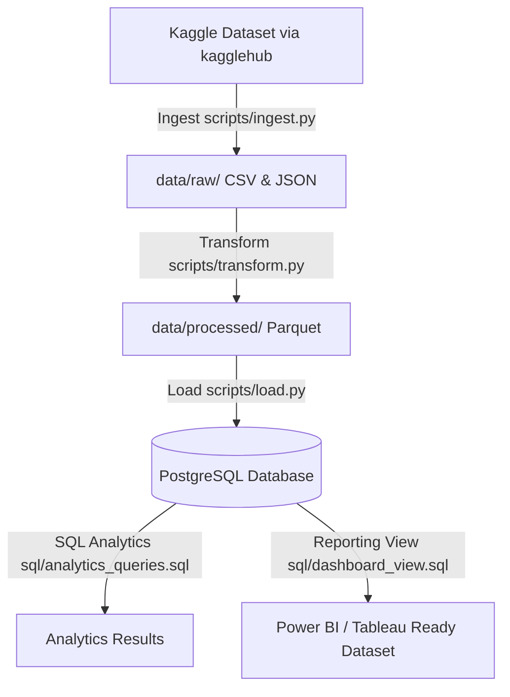

# YouTube Trending Analytics ETL Pipeline

An end-to-end, production-grade batch ETL (Extract, Transform, Load) pipeline that automates the ingestion, cleaning, transformation, and storage of YouTube trending video statistics across multiple global regions. 

This project is built using professional Data Engineering practices, including clean configuration files, structured logging, database schema definitions (PKs/FKs/Indices), SQLAlchemy integrations, containerization (Docker & pgAdmin), orchestrator scheduling (Airflow), and advanced analytics queries.

---

## Project Architecture



1. **Ingest (`ingest.py`)**: Downloads daily trending data dynamically from Kaggle using `kagglehub` and stages the raw CSV and JSON category metadata in the `data/raw` landing zone.
2. **Transform (`transform.py`)**: Loads, standardizes, deduplicates, cleanses null values, handles multi-encoding character sets, performs data quality checks, and generates derived analytical columns (e.g., engagement rates, publish hours). Saves the refined data as partitioned Parquet files (`data/processed`) to optimize queries and save storage.
3. **Load (`load.py`)**: Establishes database connections with back-off retry logic, declares relational schemas (tables, constraints, indexes), automatically creates the database and tables in PostgreSQL, and bulk-inserts the records.
4. **Orchestrate (`run_pipeline.py`)**: Controls the sequential execution of Ingest -> Transform -> Load and logs execution stats.

---

## Tech Stack
*   **Language**: Python 3.9+
*   **Data Processing**: Pandas, NumPy
*   **Storage Formats**: Parquet (via PyArrow)
*   **Database**: PostgreSQL
*   **ORM / DB Driver**: SQLAlchemy, Psycopg2-binary
*   **Containerization**: Docker, Docker Compose
*   **Workflow Orchestration**: Apache Airflow
*   **Querying**: SQL (PostgreSQL DDL & DML)

---

## Project Structure

```
DE Projects/
│
├── config/
│   └── config.yaml             # Configurations for directories, DB credentials, regions
│
├── data/
│   ├── raw/                    # Raw landing zone (CSVs & JSONs copied from Kaggle)
│   └── processed/              # Processed partitioned Parquet files
│
├── scripts/
│   ├── __init__.py             # Makes scripts folder a python package
│   ├── utils.py                # Logger setup, config loader, and DB connector with retry
│   ├── ingest.py               # Ingestion phase script (kagglehub dataset download)
│   ├── transform.py            # Transformation phase script (cleaning, feature engineering)
│   ├── load.py                 # Load phase script (SQLAlchemy schema generation & bulk load)
│   └── run_pipeline.py         # Main execution script (ETL Orchestrator)
│
├── sql/
│   ├── schema.sql              # Database table schema DDL (for reference)
│   ├── analytics_queries.sql   # The five analytical queries (e.g., top channels, categories)
│   └── dashboard_view.sql      # View creation DDL for BI reporting
│
├── dashboard/
│   └── dashboard_data.csv      # Exported BI-ready dataset (PostgreSQL view export)
│
├── docker/
│   ├── docker-compose.yml      # Local DB & pgAdmin container orchestration
│   └── Dockerfile              # Dockerfile for containerizing the ETL pipeline
│
├── airflow/
│   └── dags/
│       └── youtube_etl_dag.py  # Apache Airflow DAG to run pipeline daily
│
├── requirements.txt            # Python dependencies
├── README.md                   # Setup guide and DE Resume write-up
└── .gitignore                  # Git exclude configurations
```

---

## Local Setup & Quickstart

### Prerequisites
*   Python 3.9+ installed
*   Docker Desktop running (optional, but highly recommended for PostgreSQL)

### 1. Clone the Project & Install Dependencies
Navigate to the directory and run:
```bash
# Upgrade pip to ensure pre-compiled wheels are fetched
python -m pip install --upgrade pip

# Install dependencies using pre-compiled binary packages
pip install --only-binary :all: -r requirements.txt
```

### 2. Start PostgreSQL Database
If you have Docker, start the database and pgAdmin containers with:
```bash
docker-compose -f docker/docker-compose.yml up -d
```
*This starts a PostgreSQL instance at `localhost:5432` and pgAdmin at `http://localhost:8080` (credentials: `admin@admin.com` / `admin`).*

*(If running Postgres locally outside Docker, update the credentials in [config.yaml](file:///c:/Users/Syed%20Waseem/OneDrive/Desktop/DE%20Projects/config/config.yaml).)*

### 3. Run the ETL Pipeline
To execute the ingestion, transformation, and database load in one run:
```bash
python scripts/run_pipeline.py
```
Check progress in the terminal or monitor detailed run messages in `logs/pipeline.log`.

---

## SQL Analytics & Insights

The analytical queries are stored in [sql/analytics_queries.sql](file:///c:/Users/Syed%20Waseem/OneDrive/Desktop/DE%20Projects/sql/analytics_queries.sql).
You can run them in pgAdmin or any SQL client to see insights:
1.  **Top 3 Categories per Region**: Evaluates which categories drive the most engagement globally.
2.  **Top 10 Channels by Cumulative Likes**: Lists the channels producing the most liked videos.
3.  **Regional Performance Comparison**: Computes aggregate views and likes-to-dislikes ratios.
4.  **Top 10 Highly Engaged Videos**: Determines which videos have the highest interaction rate (likes+dislikes+comments) relative to their views.
5.  **Daily Trending Patterns**: Reveals which day of the week generates the highest number of trending videos.

---

## Dockerizing the ETL Pipeline
To containerize the Python scripts and execute the ETL pipeline inside a clean, isolated environment:
1.  Build the Docker image:
    ```bash
    docker build -t youtube-etl-pipeline -f docker/Dockerfile .
    ```
2.  Run the ETL container (sharing the docker database network):
    ```bash
    docker run --network de_network youtube-etl-pipeline
    ```

---

## Resume-Ready Project Description
You can add this project description directly to your resume for **Associate / Junior Data Engineer** roles:

> **YouTube Trending Analytics ETL Pipeline | Python, Pandas, PostgreSQL, SQLAlchemy, Parquet, Docker, Airflow**
> *   Designed and implemented an automated batch ETL pipeline to ingest, clean, and analyze daily trending YouTube video statistics (100k+ rows) across multiple global regions.
> *   Automated ingestion of raw regional datasets (CSV/JSON) using `kagglehub` and staging files in a local raw layer.
> *   Developed robust data preprocessing scripts in Pandas, standardizing columns, applying schema validation, handling multi-encoding issues, and generating derived KPIs like engagement rate and publish time analytics.
> *   Saved cleaned datasets to a processed layer as partitioned **Parquet** files using `pyarrow`, optimizing disk storage and improving downstream load times.
> *   Configured automatic database provisioning and schema generation in **PostgreSQL** using **SQLAlchemy** with custom retry connection mechanisms.
> *   Designed a dimensional star schema, optimized indices for analytical queries, and created reporting-ready database views for **Tableau/Power BI** integrations.
> *   Containerized the entire infrastructure using **Docker Compose** (Postgres + pgAdmin) and created an **Airflow DAG** to orchestrate daily ETL batch runs.
