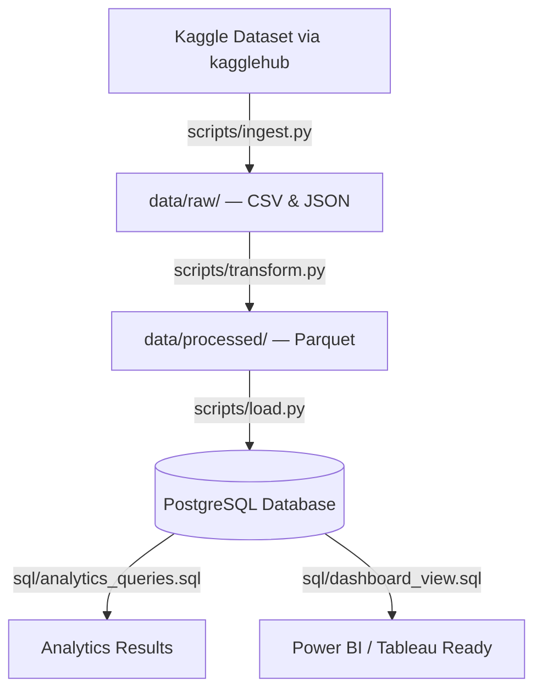

# YouTube Trending Analytics — ETL Pipeline

An end-to-end, production-grade batch ETL pipeline that automates the ingestion, cleaning, transformation, and storage of YouTube trending video statistics across multiple global regions.

Built using professional Data Engineering practices: structured logging, relational schema design (PKs / FKs / indices), SQLAlchemy ORM, Docker containerization, Apache Airflow orchestration, and advanced SQL analytics.

---

## Live Dashboard

> ### 🔴 [View Interactive Dashboard →](https://claude.ai/public/artifacts/e9dba18b-d02a-499f-b46f-cadb57259f13)
 Image: 

Real-time analytics built on pipeline output — views by region, engagement rates, top channels, category breakdown, and full pipeline execution trace.

---

## Pipeline Metrics

| Metric | Value |
|---|---|
| Raw records ingested | 239,662 |
| Cleaned records | 234,544 |
| Data quality rate | 97.8% |
| Regions processed | 6 (US · CA · GB · IN · DE · FR) |
| Video categories parsed | 32 |
| Parquet partitions | 6 (by region) |
| Total pipeline runtime | 35.71 seconds |

---

## Architecture



### How each layer works

**Ingest (`ingest.py`)** — Downloads daily trending data dynamically from Kaggle using `kagglehub` and stages raw CSV and JSON category metadata in the `data/raw` landing zone.

**Transform (`transform.py`)** — Loads, standardizes, deduplicates, cleanses null values, handles multi-encoding character sets, performs data quality checks, and engineers derived analytical columns (`engagement_rate`, `publish_hour`, `trending_day`). Saves output as partitioned Parquet files to optimize downstream queries.

**Load (`load.py`)** — Establishes database connections with back-off retry logic, declares relational schemas (tables, constraints, indexes), auto-creates tables in PostgreSQL, and bulk-inserts records.

**Orchestrate (`run_pipeline.py`)** — Controls sequential Ingest → Transform → Load execution with full logging of execution stats.

---

## Tech Stack

| Layer | Technology |
|---|---|
| Language | Python 3.9+ |
| Data processing | Pandas, NumPy |
| Storage format | Parquet (PyArrow) — partitioned by region |
| Database | PostgreSQL |
| ORM / driver | SQLAlchemy, Psycopg2-binary |
| Containerization | Docker, Docker Compose |
| Orchestration | Apache Airflow |
| Analytics | SQL (PostgreSQL DDL & DML) |
| Visualization | Power BI / Tableau |

---

## Project Structure

```
DE Projects/
│
├── config/
│   └── config.yaml              # DB credentials, regions, directories
│
├── data/
│   ├── raw/                     # Raw landing zone — CSVs & JSONs from Kaggle
│   └── processed/               # Cleaned partitioned Parquet files
│
├── scripts/
│   ├── utils.py                 # Logger, config loader, DB connector with retry
│   ├── ingest.py                # Ingestion phase — kagglehub download
│   ├── transform.py             # Transformation phase — cleaning & feature engineering
│   ├── load.py                  # Load phase — SQLAlchemy schema & bulk insert
│   └── run_pipeline.py          # Main orchestrator — Ingest → Transform → Load
│
├── sql/
│   ├── schema.sql               # Table DDL with PKs, FKs, and indices
│   ├── analytics_queries.sql    # 5 analytical queries
│   └── dashboard_view.sql       # BI-ready view DDL
│
├── dashboard/
│   └── dashboard_data.csv       # Exported BI-ready dataset
│
├── docker/
│   ├── docker-compose.yml       # PostgreSQL + pgAdmin containers
│   └── Dockerfile               # ETL pipeline containerization
│
├── airflow/
│   └── dags/
│       └── youtube_etl_dag.py   # Airflow DAG — daily scheduled pipeline
│
├── requirements.txt
├── README.md
└── .gitignore
```

---

## Getting Started

### Prerequisites
- Python 3.9+ installed
- Docker Desktop running (recommended)

### 1. Clone & install dependencies
```bash
python -m pip install --upgrade pip
pip install --only-binary :all: -r requirements.txt
```

### 2. Start PostgreSQL via Docker
```bash
docker-compose -f docker/docker-compose.yml up -d
```
> Starts PostgreSQL at `localhost:5432` and pgAdmin at `http://localhost:8080`
> Default credentials: `admin@admin.com` / `admin`

### 3. Run the full ETL pipeline
```bash
python scripts/run_pipeline.py
```
> Monitor progress in terminal or in `logs/pipeline.log`

---

## SQL Analytics & Insights

Queries live in `sql/analytics_queries.sql` — run in pgAdmin or any SQL client:

1. **Top 3 categories per region** — which categories drive the most engagement globally
2. **Top 10 channels by cumulative likes** — highest-performing channels across all regions
3. **Regional performance comparison** — aggregate views and likes-to-dislikes ratios
4. **Top 10 highly engaged videos** — highest interaction rate relative to views
5. **Daily trending patterns** — which day of the week generates the most trending videos

### Sample query
```sql
SELECT region,
       SUM(views)                              AS total_views,
       ROUND(AVG(engagement_rate)::numeric, 4) AS avg_engagement
FROM youtube_trending_statistics
GROUP BY region
ORDER BY total_views DESC;
```

---

## Docker — Containerized Pipeline

Build and run the ETL pipeline in an isolated container:

```bash
# Build image
docker build -t youtube-etl-pipeline -f docker/Dockerfile .

# Run against the DB network
docker run --network de_network youtube-etl-pipeline
```

---

## Database Schema

**youtube_categories**
| Column | Type |
|---|---|
| category_id | INT (PK) |
| category_title | VARCHAR |

**youtube_trending_statistics**
| Column | Type |
|---|---|
| video_id | VARCHAR (PK) |
| trending_date | DATE |
| region | VARCHAR (FK) |
| title | VARCHAR |
| channel_title | VARCHAR |
| category_id | INT (FK) |
| publish_time | TIMESTAMP |
| views | BIGINT |
| likes | BIGINT |
| dislikes | BIGINT |
| comment_count | BIGINT |
| engagement_rate | DOUBLE PRECISION |
| trending_day | VARCHAR |
| publish_hour | INT |

---

## Key Insights

**Top categories by region**
- Music and Entertainment dominated across most regions
- GB Music category generated 170B+ total views
- France uniquely showed Sports among top-performing categories

**Most liked channels**
- PewDiePie — 17.6M+ likes
- SMTOWN — 13.3M+ likes
- Amit Bhadana ranked among top global channels

**Regional highlights**
- GB led total views despite fewer unique videos
- France achieved the highest engagement rate (5.8%)
- Germany had the highest count of unique trending videos

---

## Planned Enhancements

- [ ] AWS S3 as centralized data lake layer (raw + processed)
- [ ] Redshift or Snowflake as cloud warehouse
- [ ] Incremental data loading (delta processing)
- [ ] Data quality checks with Great Expectations
- [ ] dbt transformation layer with lineage and tests
- [ ] Kafka streaming pipeline for real-time ingestion
- [ ] CI/CD pipeline for automated testing and deployment

---

## Author

**Syed Waseem**  
[LinkedIn](https://linkedin.com/in/syed-waseemi) · [GitHub](https://github.com/syed)  
AWS Certified Data Engineer Associate (DEA-C01)
